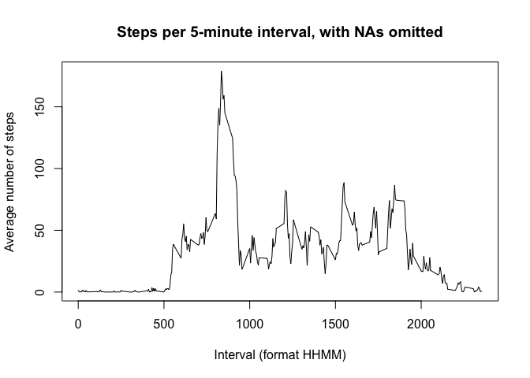

# Reproducible Research: Peer Assessment 1


## Loading and preprocessing the data
The data given for this project is the only data available, so I assumed
that it must be sufficient. To calculate the mean steps per day, only the
date and steps columns will be needed. To calculate the average daily activity,
the time interval column is also needed. Inspection of the data confirms that
exactly the required two months of data are present. In order to work with dates,
it is convenient to add another date column ("day") with datatype Date.

Unzip and read the .csv file into a dataframe.


```r
library (dplyr)
```

```
## 
## Attaching package: 'dplyr'
## 
## The following objects are masked from 'package:stats':
## 
##     filter, lag
## 
## The following objects are masked from 'package:base':
## 
##     intersect, setdiff, setequal, union
```

```r
unzip("activity.zip")
activity <- read.csv("activity.csv")
activity$day <- as.Date(activity$date)
```

Check the dates in the data to see if they are in the desired range
and if there are any missing dates.


```r
dates_wanted <- seq(as.Date('2012-10-01'), as.Date('2012-11-30'), by="days")
cat("Dates missing from the data:")
```

```
## Dates missing from the data:
```

```r
as.Date(setdiff(dates_wanted, unique(activity$day)), origin="1970-01-01")
```

```
## character(0)
```

```r
cat("Dates in the data that fall outside the range wanted:")
```

```
## Dates in the data that fall outside the range wanted:
```

```r
as.Date(setdiff(unique(activity$day), dates_wanted), origin="1970-01-01")
```

```
## character(0)
```

All the dates were in the proper range, and none were missing.

Now look for intervals outside the proper range, or missing. 
The identifiers for the intervals are formatted as HHMM.


```r
intervals_wanted <- NULL
for (h in 0:23) {
        for (m in seq(0, 55, 5)) {
                intervals_wanted <- append(intervals_wanted, c(100 * h + m))
        }
}
cat("Intervals missing from the data:")
```

```
## Intervals missing from the data:
```

```r
setdiff(intervals_wanted, unique(activity$interval))
```

```
## numeric(0)
```

```r
cat("Intervals in the data that fall outside the range wanted:")
```

```
## Intervals in the data that fall outside the range wanted:
```

```r
setdiff(unique(activity$interval), intervals_wanted)
```

```
## integer(0)
```

All the expected Intervals were included in the given data, and none were outside
the required range, so we can safely work with the data without needing any
filtering.

## What is mean total number of steps taken per day?

First, let's see a histogram of the steps taken per day.


```r
library(dplyr)
steps_per_day <- activity %>%
                 select(date, steps) %>%
                 group_by(date) %>%
                 summarize(steps = sum(steps, na.rm = TRUE))
hist(steps_per_day$steps, breaks=10, xlab = "Steps Per Day",
     main = "Steps per day, with NAs omitted")
```

 

The mean steps per day when NAs are omitted is 

```r
mean(steps_per_day$steps)
```

```
## [1] 9354.23
```

The median steps per day when NAs are omitted is 

```r
median(steps_per_day$steps)
```

```
## [1] 10395
```

## What is the average daily activity pattern?

To answer this question, we must calculate the average number 
of steps taken during each interval. To do this, we get the
total number of steps for each interval over all days by simply
ignoring the day column. Then we must divide that total by the 
number of days to get the mean.

I've renamed interval as avg_interval and steps as avg_steps, 
to avoid confusion between steps_per_interval and activity.


```r
steps_per_interval <- 
        activity %>%
        rename(avg_interval = interval) %>%
        select(avg_interval, steps) %>%
        group_by(avg_interval) %>%
        summarize(avg_steps = sum(steps, na.rm = TRUE) / length(dates_wanted))
plot(steps_per_interval$avg_interval, 
     steps_per_interval$avg_steps,
     type="l", main="Steps per 5-minute interval, with NAs omitted",
     xlab="Interval (format HHMM)", ylab="Average number of steps")
```

 

In this plot, we can see a prominent increase in activity from 
intervals 8:30 to 9:30, which corresponds to the morning rush hour.
The interval having the maximum number of steps is


```r
steps_per_interval$avg_interval[which.max(steps_per_interval$avg_steps)]
```

```
## [1] 835
```

## Imputing missing values

The data available has NAs in the **steps** column.
There are no NAs in either the **date** or **interval** columns.
There are ```sum(is.na(activity$steps))``` NAs in the **steps** column.


```r
# In this chunk, we are going to patch any NAs in activity$steps 
# with the mean of the steps for the interval containing that NA.
# The new activity dataframe is called "activity_patched". 
# This patching could be improved by recalculating the mean using 
# the patched data, but it's futile to work to get more precision out of
# missing data.

# Get the indexes of the rows with NAs.
na_inx <- which(is.na(activity$steps))

# Make a paired list (key=interval name, value=mean steps for the interval)
# to make it easy to look up the replacement value for NA.
interval_list <- list()
interval_list[as.character(steps_per_interval$avg_interval)] <- 
        steps_per_interval$avg_steps

# Now replace all NAs at once:
activity_patched <- activity
activity_patched[na_inx,"steps"] <- as.vector(mode="numeric",
                  interval_list[as.character(activity$interval[na_inx])])
```

Make a histogram of the total number of steps taken each day
Report the **mean** and **median** total number of steps taken per day. 


```r
steps_per_day_patched <- activity_patched %>%
                         select(date, steps) %>%
                         group_by(date) %>%
                         summarize(steps = sum(steps, na.rm = FALSE))
hist(steps_per_day_patched$steps, breaks=10, xlab = "Steps Per Day",
     main = "Steps per day, with NAs patched")
```

 

## How does patching the NAs affect the 
The histogram of the patched data shows a much more realistic-looking 
bell curve distribution for a healthy person. The unpatched histogram
showed too many days with very few steps, like a bedridden patient.

The mean steps per day is when NAs are patched is

```r
mean(steps_per_day_patched$steps)
```

```
## [1] 10581.01
```

The median steps per day when NAs are patched is

```r
median(steps_per_day_patched$steps)
```

```
## [1] 10395
```

By omitting the NAs in the first part of the assignment, the NAs were
effectively treated as zeros. By patching the NAs with the intervals'
means, a greater number of steps were added to all the calculations.
So this added steps to the daily mean.

The number of steps added to the mean daily steps by patching the NAs is

```r
mean(steps_per_day_patched$steps) - mean(steps_per_day$steps)
```

```
## [1] 1226.784
```

The number of steps added to the median daily steps by patching the NAs is

```r
median(steps_per_day_patched$steps) - median(steps_per_day$steps)
```

```
## [1] 0
```

I was surprised that the median had not changed, so I looked for an error 
in my program by printing the two sorted 61-day vectors. There was no error.
I discovered that when the NAs were replaced by the interval means, it 
simply rearranged some elements that were below the median, but the median 
element itself stayed exactly in its original location (at index = 31).

## Are there differences in activity patterns between weekdays and weekends?

### Add a factor column to indicate weekday and weekend.


```r
# Add a factor column to indicate weekday and weekend.
# The function julian() was used, with its origin specified on a Monday.
day_type <- c(rep("weekday", 5), rep("weekend", 2))
activity_patched$day <- 
        factor(day_type[julian(as.Date(activity_patched$date),
                               origin = as.Date("1970-01-05")) %% 7 + 1])
```

### Plot the activity per day on two separate panels, for weekdays and weekends.


```r
steps_per_interval_patched <- 
        activity_patched %>%
        rename(avg_interval = interval) %>%
        select(day, avg_interval, steps) %>%
        group_by(day, avg_interval) %>%
        summarize(avg_steps = mean(steps, na.rm = FALSE))
library(lattice)
p <- xyplot(avg_steps ~ avg_interval | day, 
            data = steps_per_interval_patched, 
            layout = c(1, 2), 
            type="l",
            main="Steps per 5-minute interval, with NAs patched",
            xlab="Interval (format HHMM)", 
            ylab="Average number of steps")
print(p)
```

 
End
